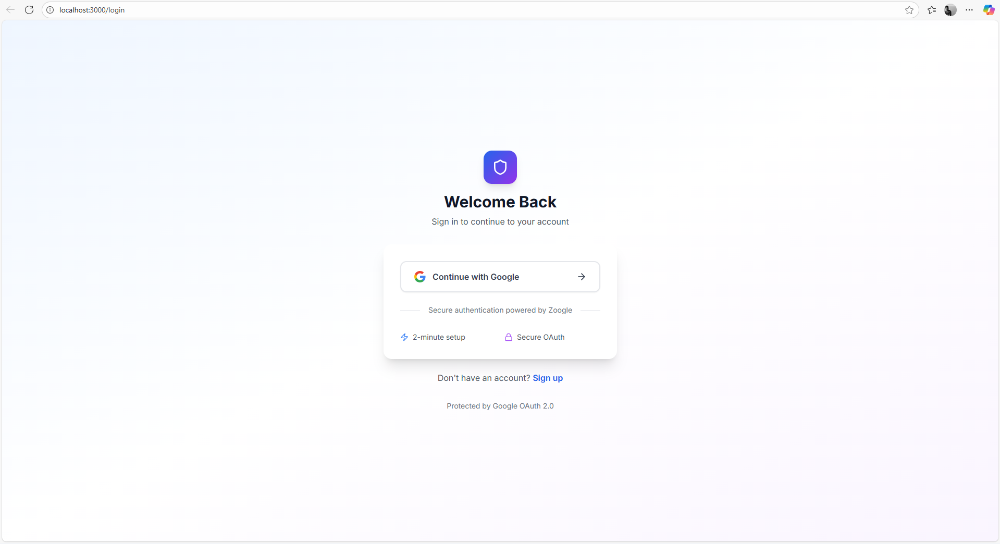
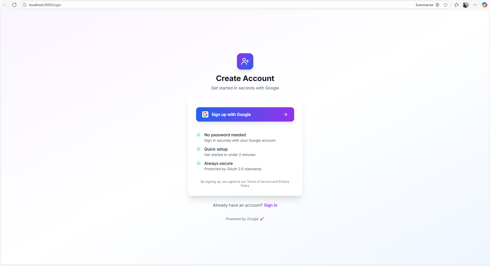

# 🚀 Zoogle Auth Template

**Add Google Login to ANY Express project in literally 2 minutes!**

A beautiful, production-ready authentication template powered by [Zoogle](https://github.com/PersuasivePost/zoogle). Just copy, paste, and you're done! ✨


---

## 📸 Screenshots



### Login Page
Clean, professional login with Google OAuth button

### Signup Page  
Modern signup experience with instant account creation

### Dashboard
Protected dashboard showing user profile and info

---

## 🎯 What You Get

```
zoogle-auth-template/
├── 📄 server.js           # Complete backend (Express + Zoogle)
├── 📄 package.json        # All dependencies
├── 📄 .env.example        # Environment template
├── 📄 README.md           # This file
└── 📁 public/
    ├── login.html         # Beautiful login page
    └── dashboard.html     # Protected dashboard
```

---

## ⚡ Quick Start

### 1️⃣ Install Dependencies (30 seconds)

```bash
npm install
```

Or manually:
```bash
npm install express zoogle dotenv
```

### 2️⃣ Get Google OAuth Credentials (1 minute)

1. Go to [Google Cloud Console](https://console.cloud.google.com)
2. Create a new project (or select existing)
3. Enable **Google+ API** (or People API)
4. Navigate to **Credentials** → **Create Credentials** → **OAuth 2.0 Client ID**
5. Add this redirect URL:
   ```
   http://localhost:3000/auth/google/callback
   ```
6. Copy your `CLIENT_ID` and `CLIENT_SECRET`

### 3️⃣ Configure Environment (30 seconds)

Create a `.env` file:

```env
GOOGLE_CLIENT_ID=your_google_client_id_here
GOOGLE_CLIENT_SECRET=your_google_client_secret_here
JWT_SECRET=your_random_secret_here
PORT=3000
CALLBACK_URL=http://localhost:3000/auth/google/callback
```

**Generate a secure JWT_SECRET:**
```bash
node -e "console.log(require('crypto').randomBytes(32).toString('hex'))"
```

### 4️⃣ Run! (10 seconds)

```bash
npm start
```

Visit:
- 🔐 **Login:** http://localhost:3000/login
- 📝 **Signup:** http://localhost:3000/signup
- 🏠 **Dashboard:** http://localhost:3000/dashboard

**That's it! You're done!** 🎉

---

## 🔧 How It Works

```
┌─────────┐      ┌──────────┐      ┌────────┐      ┌──────────┐
│ User    │─────▶│ Login    │─────▶│ Google │─────▶│ Callback │
│ Clicks  │      │ Button   │      │ OAuth  │      │ Handler  │
└─────────┘      └──────────┘      └────────┘      └──────────┘
                                                          │
                                                          ▼
┌─────────┐      ┌──────────┐      ┌────────┐      ┌──────────┐
│Dashboard│◀─────│ Store    │◀─────│ Create │◀─────│ Generate │
│ Access  │      │ Token    │      │ User   │      │ JWT      │
└─────────┘      └──────────┘      └────────┘      └──────────┘
```

1. User clicks "Continue with Google"
2. Redirected to Google OAuth consent
3. Google authenticates and returns to callback
4. Zoogle exchanges code for user profile
5. `findOrCreateUser()` saves user to database
6. JWT token generated and sent to frontend
7. Token stored in localStorage
8. User accesses protected dashboard

---

## 🛡️ Protecting Routes

Add authentication to any route:

```javascript
app.get('/api/protected', googleAuth.middleware, (req, res) => {
  // req.user contains authenticated user data
  res.json({ 
    message: `Welcome ${req.user.name}!`,
    user: req.user 
  });
});
```

---

## 💾 Database Integration

### MongoDB Example

```javascript
// In server.js, replace findOrCreateUser:
async findOrCreateUser(profile) {
  const User = require('./models/User');
  
  return await User.findOneAndUpdate(
    { googleId: profile.id },
    {
      googleId: profile.id,
      email: profile.email,
      name: profile.name,
      picture: profile.picture,
      lastLogin: new Date()
    },
    { upsert: true, new: true }
  );
}
```

### PostgreSQL Example

```javascript
async findOrCreateUser(profile) {
  const { Pool } = require('pg');
  const pool = new Pool();
  
  const result = await pool.query(
    `INSERT INTO users (google_id, email, name, picture, last_login)
     VALUES ($1, $2, $3, $4, NOW())
     ON CONFLICT (google_id)
     DO UPDATE SET last_login = NOW()
     RETURNING *`,
    [profile.id, profile.email, profile.name, profile.picture]
  );
  
  return result.rows[0];
}
```

### MySQL Example

```javascript
async findOrCreateUser(profile) {
  const mysql = require('mysql2/promise');
  const connection = await mysql.createConnection({
    host: 'localhost',
    user: 'root',
    database: 'myapp'
  });
  
  const [rows] = await connection.execute(
    `INSERT INTO users (google_id, email, name, picture, last_login)
     VALUES (?, ?, ?, ?, NOW())
     ON DUPLICATE KEY UPDATE last_login = NOW()`,
    [profile.id, profile.email, profile.name, profile.picture]
  );
  
  return rows;
}
```
---

## 📡 API Endpoints

### Public Routes

| Method | Endpoint | Description |
|--------|----------|-------------|
| GET | `/login` | Login page |
| GET | `/signup` | Signup page |
| GET | `/auth/google/login` | Start OAuth flow |
| GET | `/auth/google/callback` | OAuth callback |

### Protected Routes (Requires JWT)

| Method | Endpoint | Description |
|--------|----------|-------------|
| GET | `/dashboard` | User dashboard |
| GET | `/profile` | Get user profile |

### Example API Call

```javascript
// Frontend: Call protected API
const token = localStorage.getItem('authToken');

fetch('/profile', {
  headers: {
    'Authorization': `Bearer ${token}`
  }
})
.then(res => res.json())
.then(data => console.log(data.user));
```

---

## 🐛 Troubleshooting

### "Redirect URI mismatch"
- Ensure callback URL in Google Console matches exactly: `http://localhost:3000/auth/google/callback`
- Include `http://` or `https://`
- Check port number

### "Invalid token"
- Clear localStorage: `localStorage.clear()`
- Verify `JWT_SECRET` is set in `.env`
- Check token is sent in `Authorization: Bearer <token>` header

### "Cannot GET /"
- Ensure `public/` folder exists with HTML files
- Check `express.static('public')` is configured in server.js

### Login works but dashboard shows error
- Open browser console for errors
- Verify token is stored: `localStorage.getItem('authToken')`
- Check network tab for failed API calls

---

## 📚 Tech Stack

- **Backend:** Express.js
- **Auth:** Zoogle (Google OAuth 2.0)
- **Frontend:** HTML, Tailwind CSS, Vanilla JS
- **Security:** JWT tokens
- **Database:** Your choice (examples provided)

---

## 🎯 Use Cases

Perfect for:
- ✅ SaaS applications
- ✅ Admin dashboards
- ✅ Internal tools
- ✅ Customer portals
- ✅ Content management systems
- ✅ E-commerce platforms
- ✅ Social networks
- ✅ Any app needing user accounts

---

## 🤝 Contributing

Contributions are welcome! Feel free to:

1. Fork the repo
2. Create a feature branch (`git checkout -b feature/amazing`)
3. Commit changes (`git commit -m 'Add amazing feature'`)
4. Push to branch (`git push origin feature/amazing`)
5. Open a Pull Request

---

## 📝 License

MIT License - feel free to use this in any project!

---

## 🙏 Credits

- Built with [Zoogle](https://github.com/PersuasivePost/zoogle) by [@PersuasivePost](https://github.com/PersuasivePost)
- Styled with [Tailwind CSS](https://tailwindcss.com)
- Powered by [Express.js](https://expressjs.com)

---

## 📞 Support

- 🐛 **Issues:** [GitHub Issues](https://github.com/yourusername/zoogle-auth-template/issues)
- 💬 **Discussions:** [GitHub Discussions](https://github.com/yourusername/zoogle-auth-template/discussions)
- 📖 **Zoogle Docs:** [GitHub Repo](https://github.com/PersuasivePost/zoogle)

---

## ⭐ Show Your Support

If this helped you, give it a ⭐️! It helps others discover this template.

---

<div align="center">

**Made with ❤️ using Zoogle**

Setup Time: **2 minutes** ⏱️  
Code to Write: **0 lines** ✨  
Authentication: **Enterprise-grade** 🔐

[⭐ Star on GitHub](https://github.com/yourusername/zoogle-auth-template) • [🐛 Report Bug](https://github.com/yourusername/zoogle-auth-template/issues) • [✨ Request Feature](https://github.com/yourusername/zoogle-auth-template/issues)

</div>